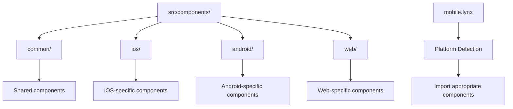

# vue-lynx-genesis

This is a prototype that integrates Lynx's powerful multi-threaded UI rendering capabilities with Vue's component system, providing a performant mobile-first development experience.

## Current Approach

This project now implements a **Vue-only approach** for Lynx integration:

- **Vue-Centric Architecture**: Full focus on Vue 3 components with Lynx integration
- **Simplified Configuration**: Uses the `@rsbuild/plugin-vue` along with custom Lynx configuration
- **iOS/Android Support**: Cross-platform mobile development from a single Vue codebase
- **Component-Based Design**: Structured for optimal reuse across platforms

The integration allows Vue applications to achieve smooth 60+ FPS animations, jank-free scrolling, and responsive interfaces by offloading business logic to a separate thread while keeping the UI rendering thread free for user interactions.

Comprehensive documentation is available in the [Vue Lynx Plugin Guide](docs/plugin-vue.md).

## Cross-Platform Support

This project supports building for multiple platforms from a single codebase:

- **Web** (default)
- **iOS**
- **Android**

### Platform-Specific Build Commands

```bash
# Web
bun run dev            # Standard web development
bun run dev:lynx       # Lynx-enabled web development
bun run build          # Build for web production

# iOS
bun run dev:ios:vue        # Development build for iOS with Vue
bun run dev:ios-qr:vue     # Development build for iOS with QR code using Vue
bun run build:ios:vue      # Production build for iOS with Vue

# Simplified Configuration
bun run dev:ios:vue:simple        # Development with simplified Vue config
bun run dev:ios-qr:vue:simple     # Development with QR code using simplified Vue config
bun run build:ios:vue:simple      # Production build with simplified Vue config
```

For detailed information on Lynx workflows and development commands, see [Lynx Workflows](LYNX-WORKFLOWS.md).

### Component Architecture

Components are organized by platform with intelligent platform detection:



This architecture allows you to:
1. Write once, run anywhere with common components
2. Create platform-specific optimizations when needed
3. Use adaptive components that automatically use the right implementation for each platform

For detailed information on the cross-platform architecture, see [Cross-Platform Architecture](docs/cross-platform-details.md).

### Counter Demo
After running `bun install` and `bun run dev:lynx` you should see this demo app running a basic counter component at http://127.0.0.1:3000


### Debug Panel
In addition, there's a debug panel that will load below the counter.


The debug panel shows an example of the following Lynx features:
- Main thread/worker thread separation for UI performance
- async message-based communication between threads
- real-time state synchronization across thread boundaries
- bidirectional message flow with timestamps
- live monitoring of the Lynx thread communication model


## Features

- 🎨 **Modern UI with Tailwind CSS**
  - Clean, responsive design
  - Beautiful component styling
  - Dark mode support
  - Custom animations and transitions

- 🔥 **Lynx Integration**
  - Multi-threaded UI rendering via Lynx
  - Thread separation with main thread for UI and worker thread for logic
  - Custom Vite plugin for seamless Vue-Lynx integration
  - Debug panel for visualizing thread communication
  - Fallback handling for graceful degradation
  - **Cross-platform support** for Web, iOS, and Android
  - **Platform-adaptive components** that automatically use the right implementation

- 🛠️ **Development Tools**
  - [Vite](https://github.com/vitejs/vite) for lightning-fast development
  - [TypeScript](https://www.typescriptlang.org/) for type safety
  - [Tailwind CSS](https://tailwindcss.com/) for utility-first styling
  - [ESLint](https://eslint.vuejs.org/) and [Prettier](https://prettier.io/) for code quality
  - [Vitest](https://vitest.dev/) for unit testing
  - [Cypress](https://docs.cypress.io) for E2E testing
  - [Webpack](https://webpack.js.org/) for bundling Lynx components

- 📦 **Core Dependencies**
  - [Vue 3](https://v3.vuejs.org/) with Composition API
  - [Vue Router](https://next.router.vuejs.org/) for routing
  - [Pinia](https://pinia.vuejs.org/) for state management
  - [Axios](https://axios-http.com/) for API requests
  - [@vueuse/core](https://vueuse.org/) for composables
  - [@lynx-js/web-core](https://lynxjs.org/) for Lynx runtime
  - [@lynx-js/web-elements](https://lynxjs.org/) for Lynx UI elements
  - [@lynx-js/rspeedy](https://lynxjs.org/) for Lynx build system
  - [HeadlessUI](https://headlessui.dev/) for unstyled, accessible UI components
  - [Heroicons](https://heroicons.com/) for SVG icons

## Quick Start

```bash
# Install dependencies
bun install

# Start development server
bun dev

# Start Lynx development server
bun dev:lynx

# Start iOS simulator
bun dev:ios-simulator

# Build for production
bun build

# Preview production build
bun serve

# Run tests
bun test
```

## Development Scripts

- `bun dev` - Start development server
  - Runs the traditional Vue application without Lynx integration
  - Uses `src/main.ts` as the entry point
  - Useful for compatibility testing and comparing performance
  - Provides a fallback development environment

- `bun dev:lynx` - Start Lynx development server
  - Opens the application with Lynx integration at `/lynx.html`
  - Uses `src/main.ts` as the entry point with Lynx web components
  - Demonstrates the multi-threaded UI architecture
  - Shows real-time thread communication in the debug panel

- `bun dev:ios` - Start iOS development server
  - Uses `src/index.js` as the entry point
  - Builds the app with iOS-specific configurations
  - For testing on iOS devices or simulator

- `bun dev:ios-simulator` - Start iOS simulator development server
  - Uses `src/index.js` as the entry point
  - Automatically opens the app in the iOS simulator
  - Great for testing iOS-specific components

- `bun dev:android` - Start Android development server
  - Uses `src/index.js` as the entry point
  - Builds the app with Android-specific configurations
  - For testing on Android devices or emulator

- `bun build` - Build for production (web)
  - Uses `src/main.ts` as the entry point
- `bun build:ios` - Build for iOS
  - Uses `src/index.js` as the entry point
- `bun build:android` - Build for Android
  - Uses `src/index.js` as the entry point
- `bun build:lynx` - Build Lynx bundle
- `bun serve` - Preview production build
- `bun test` - Run all tests
- `bun test:unit` - Run unit tests
- `bun test:unit:vitest:ui` - Run unit tests with UI
- `bun lint` - Run linting
- `bun clean:cache` - Clean cache
- `bun clean:lib` - Clean dependencies

While the project is evolving, both standard and Lynx-enabled development paths are maintained to allow for testing, comparison, and gradual component migration.

## Vue-Lynx Integration

This project includes an integration between [Vue](https://vuejs.org/) and [Lynx](https://lynxjs.org/), enabling developers to leverage Vue's component system with Lynx's high-performance rendering engine.

### What is Lynx?

Lynx is a high-performance UI framework that uses a dual-thread architecture to achieve smooth 60+ FPS rendering:
- **Main Thread**: Handles UI rendering and user interactions
- **Background Thread**: Handles business logic and state management

This separation ensures that UI operations never block the main thread, resulting in smoother animations and more responsive interfaces.

### Integration Approach

1. **Vue Components for Lynx**
   - Uses standard Vue Single File Components
   - Integrates with Lynx's dual-thread architecture
   - Provides a familiar development experience for Vue developers

2. **Thread Communication**
   - Background worker thread for business logic and state management
   - Main thread for UI rendering and user interaction
   - Message-based communication between threads

3. **Rspeedy Plugin Integration**
   - Uses `@rsbuild/plugin-vue` for Vue component support
   - Optimizes for Lynx runtime with custom configuration
   - Seamless developer experience with Vue Single File Components

4. **Simplified Configuration**
   - Minimal configuration needed for Vue-Lynx integration
   - Support for both standard and simplified configurations
   - Built-in iOS and Android platform targeting

### Example Component

```vue
<!-- LynxCounter.vue -->
<template>
  <div class="counter-container">
    <h2 class="counter-title">Lynx Counter Demo</h2>
    <p class="counter-value">Count: {{ count }}</p>
    <div class="button-row">
      <button @click="decrement">-</button>
      <button @click="increment">+</button>
      <button @click="reset">Reset</button>
    </div>
  </div>
</template>

<script setup>
import { ref } from 'vue';

const count = ref(0);

function increment() {
  count.value++;
  // Thread communication could be added here
}

function decrement() {
  count.value--;
}

function reset() {
  count.value = 0;
}
</script>
```

### Getting Started with Vue-Lynx

1. Install dependencies with `bun install`
2. Create Vue components in the `src/components/` directory 
3. Run the development server with `bun run dev:ios:vue:simple`
4. View the app in the iOS simulator or scan the QR code with a Lynx-compatible device

### Key Files

- `lynx.vue.simple.config.js`: Simplified configuration for Vue Lynx builds
- `lynx.vue.config.ts`: Full configuration with plugin-based approach
- `src/lynx-main.ts`: Main thread entry point for Lynx
- `src/App.vue`: Main Vue application component
- `src/types/vue-lynx.d.ts`: TypeScript definitions for Vue Lynx runtime

## Project Structure

```
src/
├── assets/        # Static assets
├── components/    # Vue components
│   ├── common/    # Components shared across all platforms
│   ├── ios/       # iOS-specific components
│   ├── android/   # Android-specific components
│   └── web/       # Web-specific components
├── composables/   # Vue composables
├── layouts/       # Layout components
├── router/        # Vue Router configuration
├── stores/        # Pinia stores
├── styles/        # Global styles
├── types/         # TypeScript types
├── views/         # Page components
├── mobile.lynx    # Entry point for mobile platforms
├── main.lynx      # Entry point for web
├── lynx-main.ts   # Lynx main thread entry
├── lynx-worker.ts # Lynx worker thread
├── main.ts        # Web application entry point
└── index.js       # Lynx mobile platforms entry point
```

## Entry Point Architecture

This project utilizes a dual entry point architecture to support different platforms and environments:

### 1. src/main.ts (Web/Browser Entry Point)

The `src/main.ts` file serves as the standard entry point for the Vue application when targeting web browsers:

- Creates a Vue app with `App.vue` as the root component
- Sets up routing and global components
- Loads necessary CSS and Lynx web components
- Mounts to the standard `#app` element in the DOM

**Used by:** `bun run dev` and `bun run build` commands (standard web development)

### 2. src/index.js (Lynx Mobile Entry Point)

The `src/index.js` file serves as the specialized entry point for Lynx mobile platforms:

- Initializes the Vue-Lynx adapter for thread communication
- Creates a Vue app with `Mobile.vue` as the root component (different from web)
- Uses environment detection to handle both Lynx and browser environments
- Applies different mounting strategies based on the detected environment
- Exports the app instance for Lynx runtime

**Used by:** `bun run dev:ios`, `bun run dev:android`, `bun run build:ios`, and `bun run build:android` commands

### Build Configuration

The entry points are specified in different build configurations:

1. **Vite Configuration**: Uses `src/main.ts` by default for web development
2. **Lynx Configuration Files**:
   - `lynx.ios.config.js` specifies `entry: './src/index.js'` for iOS builds
   - `lynx.android.config.js` specifies `entry: './src/index.js'` for Android builds

This dual entry point approach allows the project to:
- Support multiple platform targets with optimized experiences
- Share common components and logic across platforms
- Apply platform-specific adaptations at the root level
- Maintain backward compatibility with standard web development

### TypeScript Migration

While `main.ts` already uses TypeScript, we're gradually migrating all JavaScript files (including `index.js`) to TypeScript for better type safety and developer experience.

## Testing Lynx Components

Testing components that use Lynx elements requires a specialized approach due to the custom elements being used. I tried getting it to work with Vitest, but ran into multiple issues. For now, the project includes multiple testing strategies:

### Component Validation

For reliable component validation, use the component checker:

```bash
# Run the component validator
bun test:components
```

This validator:
- Checks all components in the `src/components` directory
- Verifies Vue SFC structure using the Vue compiler
- Identifies Lynx components automatically
- Provides a clear summary of valid and invalid components

### Basic Component Tests

For simple component existence validation:

```bash
# Run simplified component tests
bun test:simple
```

This validates that components exist and can be loaded without executing complex test logic.

### Traditional Testing (Known Issues)

The project also includes Vitest configuration, but there are known issues with testing Lynx components using Vitest:

```bash
# Run Vitest UI (may encounter stalling issues with Lynx components)
bun test:unit:vitest:ui
```

> **Important**: The traditional tests using Vitest may stall when testing Lynx components due to issues with custom elements in JSDOM. Use the component validator approach instead for reliable testing.

### Recommended Testing Workflow

1. Use `bun test:components` for regular validation during development
2. Add specific test cases to the simplified test runners when needed
3. Only use the Vitest framework for standard Vue components (non-Lynx)

This approach provides reliable validation while working with the experimental Lynx integration.

## Webpack and Vite Integration

This project uses both Vite and Webpack for different purposes:

### Why Both Bundlers?

- **Vite** powers the main Vue application with its fast development server and optimized production builds.
- **Webpack** specifically handles the Vue-Lynx integration via `webpack.lynx.config.js`.

### The Role of webpack.lynx.config.js

The `webpack.lynx.config.js` file serves several critical functions:

1. **Custom Lynx Handling**: Processes `.lynx` files and integrates them with Vue components
2. **Thread Separation**: Bundles the Lynx-specific code that runs in the worker thread
3. **Vue Loader Integration**: Ensures Vue SFCs work properly with Lynx elements 
4. **Output Generation**: Creates the `main.web.bundle` file in the public directory that powers the Lynx runtime

This dual-bundler approach allows us to leverage Vite's speed for general Vue development while using Webpack's flexibility for the specialized Lynx integration requirements.

### Build Process

When developing or building:

1. `bun dev` runs the standard Vite development server
2. `bun dev:lynx` runs Vite but loads the Lynx-enabled entry point
3. `bun build:lynx:webpack` runs Webpack to build the Lynx bundle
4. `bun build` runs the standard Vite build process

This separation makes it possible to incrementally adopt Lynx in an existing Vue application without disrupting the standard workflow.

## License

This project is licensed under the Apache 2.0 License - see the [LICENSE](LICENSE) file for details.

## Author

Copyright (c) 2025-present, Mike Delucchi - Zanuka Labs LLC.
